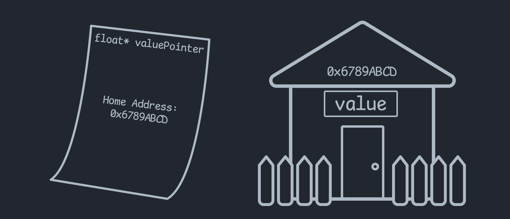

When making games in the Unity Engine, you almost never have to touch `unsafe` code. Some of you may have never even heard of it. In fact, good number of you could go your whole life without ever needing to touch `unsafe` code.

But if/when you *do* have to use `unsafe` code, it can be pretty scary. I mean, it must be called ⚠️***UNSAFE***⚠️ for a reason right?

Well, in some sense, you *should* be a little scared. But it should definitely not be because you don't know what could happen. I want to demystify unsafe code. I will go over what it is and why it is called `unsafe`, how Unity has handled it in their own codebase, and other ways to handle it on your own if you need to.

## What is `unsafe` code?

`unsafe` code, is code that requires you to surround it with an `unsafe` block. That looks a little like this:

```csharp
float value = 5;

unsafe {
    float* valuePointer = &value; // pointers are UNSAFE!
    doSomethingWith(valuePointer);
}
```

You can see in the example we used something called a **pointer**. In fact, the only reason that the `unsafe` block exists is because of pointers.

### So what is a pointer?

A pointer is a value that points to the spot in memory where a variable's data lives.

So in the example above, we have a floating point variable called `value`. The number exists somewhere in your computers RAM. We then take the pointer to the variable using `float* valuePointer = &value;`. The `&` symbol here is what extracts the pointer from the variable. The `floatPointer` can now be thought of as containing the home address of the value;



Now everything is all fine and dandy, and this pointer may be used to get the data from that address any time. However, something dangerous is afoot. Let's say `value` moves homes. Or (*bless their soul*🙏) `value` gets taken to a better place by the garbage collector and the house is destroyed. Well the pointer still points to the same address, but who knows what could be residing there now. *IT MAY NOT EVEN BE A FLOAT ANYMORE!*

So now, if you were to read the data at that address, it would be anyone's guess what you get back. Or ***EVEN WORSE*** if you write data to that address, you could be completely corrupting the data for some unrelated object now sitting in that spot in memory.

This can cause what is called **undefined behaviour** in the programming world. It has been the bane of many programmers for a long time, and will usually end up crashing the program. So when **C#** came around they decided to protect these pointers behind the `unsafe` wall, so that you can only use them if you *KNOW* what you are doing.

Let's take a look at how Unity uses `unsafe` code in their codebase.

## Where and why does Unity use `unsafe` code?

With the introduction of the [Unity Job System](https://docs.unity3d.com/Manual/JobSystem.html) and [Burst Compiler](https://docs.unity3d.com/Packages/com.unity.burst@0.2/manual/index.html) unity has started to use a lot more `unsafe` code in their codebase. Since these workflows deal so much with native code, all memory needs to be allocated in a special way and requires passing around pointers from managed memory to the native compiled code.

We will take a look at the `NativeArray<T>` class as an example.

```csharp
// sections have been removed for brevity
public struct NativeArray<T> : IDisposable where T : struct
{
    ...
    
    internal unsafe void* m_Buffer;
    
    ...
    
    internal DisposeSentinel m_DisposeSentinel;
    
    ...
}
```

You will notice a few things here. There is a `void*` called a void pointer. This represents a pointer to what could be anything. But the other thing here is actually a managed object called `DisposeSentinel`. This is a safety mechanism that unity has added to make sure memory gets cleaned up.

A problem that can happen when we are allocating memory outside our managed space, is the fact that the garbage collector has no idea that it exists. Which means that *WE* have to be sure to clean it up manually. Unity has a slight remedy for this by using a `DisposeSentinel`.

The `DisposeSentinel` is a managed object that exists within the scope of the garbage collector. So that means that when the garbage collector comes around to clean it up it will call something in the object called a **Destructor**. That looks a little like this:

```csharp
public sealed class DisposeSentinel
{
    ~DisposeSentinel()
    {
        // do something
    }
}
```

A destructor is called when the garbage collector cleans up the memory for an object. This destructor is utilized by unity to watch over and clean up the memory that it is in charge of, in case it is never disposed. It will also throw a warning that looks something like this, `A Native Collection has not been disposed, resulting in a memory leak.` It will give these warnings because having a managed object in the struct along with other safety checks can effect performance, and in builds will often be disabled. So unity encourages the developer to find and clean up these leaks themselves before release.

# How can we handle `unsafe` code on our own?

Sometimes you will have to write your own native objects and use `unsafe` code on your own without the help of unity's nice wrappers. I have had to do this in [previous blog posts](../unity-audio-generation-performance/).

The big thing you always have to think about, is making sure you create an architecture that cannot be used incorrectly. And if you must leave around `unsafe` code unprotected, you should make sure to keep it heavily tested.

In my last post, I chose to go the route of completely protecting my `unsafe` code behind an [Assembly Definition](https://docs.unity3d.com/Manual/ScriptCompilationAssemblyDefinitionFiles.html). And within that seperate assembly, I only exposed native objects in a manner that (I think) is completely safe. This is done in a similar way to unity's method, except instead of having a `DisposeSentinel` inside the structs, I opted to wrap all native objects within a managed object called `NativeBox<T>`.

`NativeBox<T>` is not an object you will find online, it is a custom object I have created to managed native objects. It looks a little like this:

I have added comments to explain what is going on
```csharp
public class NativeBox<T> : IDisposable where T : INativeObject
{
    // I keep the native struct stored in a member of this class
    private T _data;
    public ref T Data => ref _data;
    
    // and I have a check to make sure the object is not disposed already
    public bool Allocated => _data.Allocated;

    // the native box constructor is kept internal, as we do not need
    // to be creatingthese outside the assembly
    internal NativeBox(T data)
    {
        _data = data;
    }

    // just like the unity example, we use a destructor
    ~NativeBox()
    {
        ReleaseUnmanagedResources();
    }

    // the destructor will call this to release the native object
    private void ReleaseUnmanagedResources()
    {
        if (!_data.Allocated) return;
        _data.ReleaseResources();
    }

    // in the event that this object is disposed manually,
    // supress the destructor so that it doesnt try to dispose twice
    public void Dispose()
    {
        ReleaseUnmanagedResources();
        GC.SuppressFinalize(this);
    }
}
```

Now this only covers the problem of leaving behind memory, and not the problem of dangling pointers to old memory positions. But the idea is the same. Try your best to keep the pointer logic to small discreet objects, so that you don't lose track of what things can go wrong.

## Conclusion

All in all, I have covered what `unsafe` code is and why it is dangerous. I have also showed a few ways that unsafe code has been handled by unity and by me. I hope that, armed with this newfound knowledge, you can be more confident in your adventures in the world of `unsafe` code. Have fun!