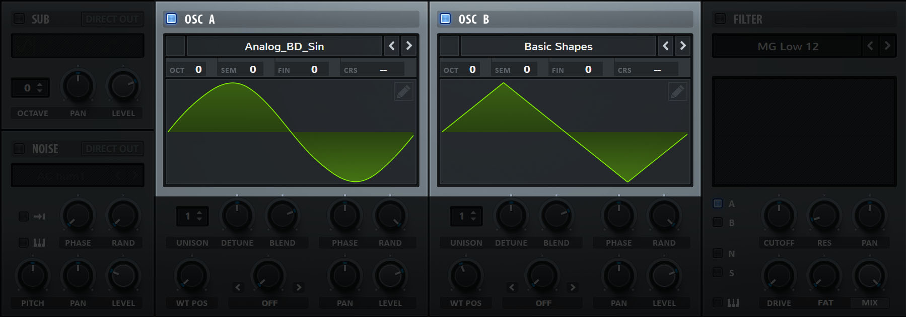

<h1>Table of Contents</h1>

- [**Introduction**](#introduction)
- [**(Part 0) Fundamentals**](#fundamentals)
    - [How is sound made?](#how-is-sound-made)
    - [Understanding Digital Waves](#understanding-digital-waves)
    - [Creating digital signals](#creating-digital-signals)
        - [Oscillators](#oscillators)
        - [Filters](#filters)
- [🔗 **(Part 1) Creating Simple Sounds**](/2022/unity-audio-generation-simple-sounds/#creating-simple-sounds)

# Introduction
In this series we will explore how sound is created digitally, and how we can take control of those processes ourselves. We will begin with some fundamentals, but the meat of this will be creating an efficient system for generating sound at runtime in C# using the Unity Engine.

While we will spend a lot of time writing code for the Unity Engine specifically, the fundamentals and design choices will still hold for any other engine or language. So strap in, and let's get started!

---

# Fundamentals
## How is sound made?
While listening to music, you are able to hear many parts: guitar, drums, piano, vocals, etc. But the crazy part is that all of that information is encoded into a single wave. That is because it's also exactly how we hear sound. 

*Sound is just a pressure wave in the air, and when it happens at the right speeds, we hear sound.*

When a band is playing on stage, and you are in the crowd, all the instruments are vibrating and creating pressure waves in the air. But *most people* only have 2 ears, so how are you hearing more than 2 things at once?

We can think of the air in this situation, like the surface of the water in a pool. There can be many people splashing in the pool making waves at the same time. But at any given point in the pool, the water level is the combination of all those waves converging to form one complex pseudo-random wave.

The same thing happens in the air with the musical instruments. All the sound waves converge to make one big complex wave the moment it hits your eardrum. The crazy part is that our brains have adapted to decode this information really well, allowing us to enjoy an entire symphony of music!

## Understanding Digital Waves
While sound in the physical world is made up of waves, sound in the digital world is represented as a series of values *(aka. samples)* between **-1** and **1** that tell the speaker cone where to be at a given point in time. How many points there are within a 1-second period of time is called the **Sampling Rate**. And the speaker cone moving back and forth does its best to recreate the exact sound waves you would hear in the physical world.

*One of the more common sampling rates is **44100 samples per second (44.1kHz). THATS A LOT OF SAMPLES*** 😮

One of the reason so many samples are used, is to provide enough data so that it doesn't *<ins>actually sound</ins>* like there are any samples. Sampling rates were first discussed quite some time ago. *(the 1940s to be exact)* As part of the **Nyquist-Shannon theorem** it states that a sampling rate must have twice the frequency of the original recording in order to be faithfully reproduced.

We know that the human ear can hear frequencies approximately between **20 hertz (20Hz)** and **20 kilohertz (20kHz)**. This means that 44.1kHz is plenty over double the range of human ear's maximum frequency.

There are other reasons for the numbers that are chosen, but for our case it doesn't matter too much. With all the jargon and history aside, what you end up with is a series of points that represent a waveform for your speakers to produce like this:

All those singers, guitars, and drums are encoded into this single stream of values.

## Creating digital signals
Now that we know what digital waves are made up of, how can we craft them ourselves from nothing? There are many methods at which digital signals are generated and processed. In this section however, we will mainly cover **Oscillators** and **Filters** as these are the main ways that we will be generating sounds in the Unity Engine.

### Oscillators

Seen above is an industry standard audio synthesizer called Serum. Highlighted are two of its **Oscillators** with different **Wave Shapes**.

Oscillators take a wave shape, and repeat the wave at a specified number of times per second *(aka its frequency)* to create the sound of whatever note should be played. The wave shapes can be swapped out and changed over time to create many advanced sounds.

Oscillators are used in a form of synthesis called **Additive Synthesis**. In a nutshell this means that sound is created by adding various different frequencies of wave shapes together. Multiple oscillators are usually used together to create unique sound.

### Filters
While oscillators produce unique wave sounds, filters process incoming waves to modify the way a waveform sounds.

These are more general and can take many forms. They can do anything from audio equalizing or adding reverb, to completely changing the shape and wave of the overall sound.

parametric equalizer and reverb in FL Studio

Multiple signals can be processed together to create unique sounds, and filters could even contain their own oscillators! These will usually make up the bulk of shaping how a sound is made.

**Next Section → [Creating Simple Sounds](/2022/unity-audio-generation-simple-sounds/#creating-simple-sounds)**