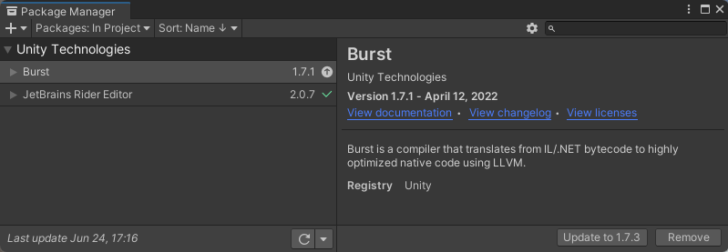

<h1>Table of Contents</h1>

- [🔗 **Introduction**](/2022/unity-audio-generation-fundamentals/#introduction)
- [🔗 **(Part 0) Fundamentals**](/2022/unity-audio-generation-fundamentals/#fundamentals)
- [🟢 **(Part 1) Creating Simple Sounds**](#creating-simple-sounds)
  - [Project Setup](#project-setup)
  - [Hooking into the sound engine](#hooking-into-the-sound-engine)
  - [Creating your first Synth](#creating-your-first-synth)
- [🔗 **(Part 2) Performance and Architecture**](/2022/unity-audio-generation-performance#performance-and-architecture)

# Creating Simple Sounds
In this post we will cover getting a project set up and start laying down the groundwork for generating sound in the Unity Engine. The previous post covered a basic understanding of what digital sound is, and also provided some insight into the vocabulary we will be referencing. If you have never dealt with digital sound manipulation before, it may be worth your time to [go back and take a look](/2022/unity-audio-generation-fundamentals).

## Project Setup
Create a new Unity project. The editor used in this post is version **2020.3.19f1**. I will be calling this project **Synthic** because I thought the name sounded cool. *(I will also be using the 'synth' verbiage in a lot of my classes too)*

Unity comes with a BUNCH of preinstalled packages in the [package manager](https://docs.unity3d.com/Packages/com.unity.package-manager-ui@1.8/manual/index.html). For the sake of keeping things clean, we will remove pretty much all of them, and only add ones we know we will need right now.



One big thing that we need to install is the [**Unity Burst Compiler**](https://docs.unity3d.com/Packages/com.unity.burst@0.2-preview.20/). The burst compiler is some voodoo magic that takes standard C# IL/.NET bytecode and compiles it down to *REALLY* fast native code. We will be using this heavily to generate sounds because performance is *critical* when generating sounds at runtime.

The only other package I have is one for my specific <abbr data-title="Integrated Development Environment">IDE</abbr>, which happens to be [JetBrains Rider](https://www.jetbrains.com/rider/). You dont *need* to use this IDE, but it's my IDE of choice.

With our editor up and running, lets start hooking into the sound engine.

## Hooking into the sound engine
Unity's MonoBehaviour allows for a method called `OnAudioFilterRead`. This is usually used to process incoming audio, but nothing is stopping us from *creating* audio in the first place. The only requirement is that we have an empty [`AudioSource`](https://docs.unity3d.com/Manual/class-AudioSource.html) component on our game object as well.

```csharp
public class AudioGenerator : MonoBehaviour
{
    private void OnAudioFilterRead(float[] data, int channels)
    {
        // sound generation logic goes here
    }
}
```

The `float` array is what we call an audio buffer. This contains the samples for the next section of audio playing in Unity's sound engine. This should currently be set to have **2048** samples. This is because, by default, unity's buffer length is 1024, and there are 2 audio channels *(one for left and right)*.

The order of the data when in 2 channel mode is an interleaving of the samples as a left right repeating pattern *(other modes follow a similar paradigm just with more channels)*:


Now that we have an entry point into the sound engine, and understand the data layout, let's build a simple synth to get us started.

## Creating your first Synth

First we need to make a new script. I'm calling mine `SimpleSineGenerator` as we will be generating a single sine wave with it. For this first generator, we are not going to set up an architecture yet, or worry about performance. This will simply be an introduction into how a generator may be constructed.

There are a few parameters we could expose in the inspector. We will use `frequency` and `amplitude` for this example. Here is what our class should look like right now:

```csharp
public class SimpleSineGenerator : MonoBehaviour
{
    [SerializeField, Range(0, 1)] private float amplitude = 0.5f;
    [SerializeField] private float frequency = 261.62f; // middle C

    private void OnAudioFilterRead(float[] data, int channels)
    {
        // TODO: Generate Sine Wave
    }
}
```

As we generate audio, we will need to keep track of where in the wave we currently are. To do this, let's create a private variable to track how many samples we have generated. We can convert that number later into a *phase*[^fn-phase].

We also need to keep track of the current *Sampling Rate*. We will grab this in the `Awake` method and, for now, just assume it doesn't change.

Add these variables to the class where you like:
```csharp
private int _sampleRate;
private long _currentSample;
```

Now lets get to the meat of the generation. We will start by looping over and operating on all the samples in the buffer. After we will increase the `_currentSample` by the number of samples processed.

```csharp
private void OnAudioFilterRead(float[] data, int channels)
{
    for (int sample = 0; sample < data.Length; sample += channels)
    {
        // TODO: operate on samples
    }

    // increase sample progress for next iteration
    // this needs to be divided by the channels value to account for
    // the fact that all channels are represented in the same buffer
    _currentSample += data.Length / channels;
}
```

While looping over the samples we need to do the following:
1. calculate the exact sample number for the current sample
2. convert that sample number into a *phase* based on the *frequency* and *sample rate*
3. calculate what that phase value represents on a sine wave
4. apply that value to every channel in the buffer

Here is the logic I added to my loop:
```csharp
for (int sample = 0; sample < data.Length; sample += channels)
{
    // get total sample progress
    long totalSamples = _currentSample + sample / channels;

    // create a divisor for converting samples to phase
    float sampleFrequency = _sampleRate / frequency;
  
    // convert sample progress into a phase based on frequency
    float phase = totalSamples % sampleFrequency / sampleFrequency;

    // get value of phase on a sine wave
    float value = Mathf.Sin(phase * 2 * Mathf.PI) * amplitude;

    // populate all channels with the values
    for (int channel = 0; channel < channels; channel++)
    {
        data[sample + channel] = value;
    }
}
```

With all that completed, make sure you apply this component with an empty audio source onto a game object, and hit play!

You should hear a middle C sine wave! *(assuming you haven't changed the frequency)*

It should sound like this:



**Next Section → [Performance and Architecture](/2022/unity-audio-generation-performance/#performanxe-and-architecture)**

---

[^fn-phase]: ***Phase*** is the current position within one cycle of a wave. [See Wikipedia Definition](https://en.wikipedia.org/wiki/Phase_(waves)) <br> For simplicity we use a value between 0 and 1, but this is also commonly between 0 and 2π.