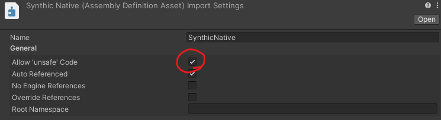

<h1>Table of Contents</h1>

- [🔗 **Introduction**](/2022/unity-audio-generation-fundamentals/#introduction)
- [🔗 **(Part 0) Fundamentals**](/2022/unity-audio-generation-fundamentals/#fundamentals)
- [🔗 **(Part 1) Creating Simple Sounds**](/2022/unity-audio-generation-simple-sounds/#creating-simple-sounds)
- [🟢 **(Part 2) Performance and Architecture**](#performance-and-architecture)
  - [Native Buffers](#native-buffers)
    - [Assembly Definitions](#assembly-definitions)
    - [`BufferHandler<T>`](#buffer-handler)
    - [`INativeObject` & `NativeBox<T>`](#inativeobject--nativeboxt)
    - [`SynthBuffer`](#synthbuffer)
  - [Buffer Pipeline](#buffer-pipeline)
    - [`SynthProvider`](#synthprovider)
    - [`SynthOut`](#synthout)
    - [`SineGenerator`](#sinegenerator)
    - [Connecting the components](#connecting-the-components)

# Performance and Architecture

Here is what my component looks like in the inspector while in play mode:


If you look at the *ms counter* next to the amplitude meter, you can see that this is taking approximately **0.17ms** to fill the buffer. This is actually pretty fast, but not fast enough. We essentially have a single oscillator making a single wave. Later on when we need *MANY* oscillators and filters all chained together, this will become completely unmanageable.

Our current default sampling rate is **48000** samples per second. The buffer size for each channel is currently **1024**. Which means that for each iteration, we only have **1024 / 48000 ≈ 0.021** seconds to fill the buffer. Which means we have approximately **21ms** for all audio operations.

This means that we could run... oh... **123** oscillators with that speed? Doesn't sound half bad right? Well... yes, but not when we take into account the fact that our little oscillator is quite a simple calculation to make. If we wanted to make anything more complex, we are going to just eat up our precious milliseconds before we know it.

So let's create some tools for us to use to squeeze every drop of performance we can out of our system using the beautiful **Burst Compiler**. The burst compiler is able to take our fancy managed C# code, and convert it into blazing fast highly optimized native code. This *SIGNIFICANTLY* increases execution speed for certain functions, but the architecture has to be built around its drawbacks.

## Native Buffers

One drawback of native code is that we can no longer pass in managed objects. Unfortunately this includes arrays like `float[]`. You also may know of a struct called [`NativeArray`](https://docs.unity3d.com/ScriptReference/Unity.Collections.NativeArray_1.html), but this is unfortunately only able to be used in jobs and *not* burst compiled methods because it has a [`DisposeSentinel`](https://docs.unity3d.com/ScriptReference/Unity.Collections.LowLevel.Unsafe.DisposeSentinel.html) in it. So lets make our own.

### Assembly Definitions
When working with native code, we will have to use the `unsafe` keyword. This is not normally allowed in our unity code without modifying the unity settings. However, we can use something called an **Assembly Definition** to section off a portion of our code into its own assembly. We can expressly enable unsafe code here, and keep it contained to this assembly as well.



With a native assembly set up, lets create our buffer library.

### `BufferHandler<T>`

We will need a first struct that allocates native memory for us. Let's call it `BufferHandler`. This can be used in many places, so we will keep it generic for now. We will also keep it internal One downside of not having the DisposeSentinel, is that if we aren't careful about disposing this ourselves, it can leave the data on the heap and start leaking memory. We will need to make sure to keep that in mind when working with this, and set up a structure for it to be used safely.

```csharp
[StructLayout(LayoutKind.Sequential)]
internal unsafe struct BufferHandler<T> : IDisposable where T : unmanaged
{
    public int Length { get; private set; }
    public T* Pointer { get; private set; }
    public bool Allocated => (IntPtr) Pointer != IntPtr.Zero;

    public BufferHandler(int length)
    {
        Length = length;
        Pointer = (T*) UnsafeUtility.Malloc(Length * sizeof(T),
            UnsafeUtility.AlignOf<T>(), Allocator.Persistent);
    }
    
    public void Dispose()
    {
        if (!Allocated) return;
        UnsafeUtility.Free(Pointer, Allocator.Persistent);
        Pointer = (T*) IntPtr.Zero;
    }
}
```

Now that we are working in the native world. We will need a way to copy that data back to the managed world efficiently at some point. So let's add a method to our `BufferHandler` to copy data into a managed array. We will have to **pin** the managed array when we copy the memory so that it can't move while we copy. It can be released immediately after.

```csharp
public void CopyTo(T[] managedArray)
{
    if (!Allocated) throw new ObjectDisposedException("Cannot copy. Buffer has been disposed");
    int length = Math.Min(managedArray.Length, Length);
    GCHandle gcHandle = GCHandle.Alloc(managedArray, GCHandleType.Pinned);
    UnsafeUtility.MemCpy((void*) gcHandle.AddrOfPinnedObject(), Pointer, length * sizeof(T));
    gcHandle.Free();
}
```

And while we are at it, lets create a method to copy into its fellow buffers for when we need to move data around later.

```csharp
public void CopyTo(BufferHandler<T> buffer)
{
    if (!Allocated) throw new ObjectDisposedException("Cannot copy. Source buffer has been disposed");
    if (!buffer.Allocated) throw new ObjectDisposedException("Cannot copy. Dest buffer has been disposed");
    int length = Math.Min(Length, buffer.Length);
    UnsafeUtility.MemCpy(Pointer, buffer.Pointer, length * sizeof(T));
}
```

We will also need to set and get items in the buffer. We can always use the pointers for this, but it could be nice to have an abstraction for it too. To do this, lets add a [indexer](https://docs.microsoft.com/en-us/dotnet/csharp/programming-guide/indexers/).

```csharp
// use pointers to access and set the data in the buffer
public T this[int index]
{
    get
    {
        CheckAndThrow(index);
        return *(T*) ((long) Pointer + index * sizeof(T));
    }

    set
    {
        CheckAndThrow(index);
        *(T*) ((long) Pointer + index * sizeof(T)) = value;
    }
}

// utility method to validate an index in the buffer
private void CheckAndThrow(int index)
{
    if (!Allocated) throw new ObjectDisposedException("Buffer is disposed");
    if (index >= Length || index < 0)
        throw new IndexOutOfRangeException($"index:{index} out of range:0-{Length}");
}
```

### `INativeObject` & `NativeBox<T>`
To make sure that we have a safe way to use the native buffers in this library, we will create a way of wrapping it up safely.

First lets create an interface to represent a native object called `INativeObject`:
```csharp
public interface INativeObject
{
    public bool Allocated { get; }
    internal void ReleaseResources();
}
```

And we will also create a nice wrapper for this to be used outside the library called `NativeBox<T>`:
```csharp
public class NativeBox<T> : IDisposable where T : INativeObject
{
    private T _data;
    public ref T Data => ref _data;
    public bool Allocated => _data.Allocated;

    internal NativeBox(T data)
    {
        _data = data;
    }

    ~NativeBox()
    {
        ReleaseUnmanagedResources();
    }

    private void ReleaseUnmanagedResources()
    {
        if (!_data.Allocated) return;
        _data.ReleaseResources();
    }

    public void Dispose()
    {
        ReleaseUnmanagedResources();
        GC.SuppressFinalize(this);
    }
}
```

### `SynthBuffer`

Let's now create the object to contain our audio buffer data. We will call this our `SynthBuffer`. We will store data in here about the properties of the buffer, so we can keep everything we need in one spot.

We will also expose some methods to pass through important information from the buffer itself like the CopyTo and indexers.

The important part is that there is no constructor, but instead a `Construct` method that creates and returns a `NativeBox<SynthBuffer>` object. This means that no matter what our buffer is always used in a safe way.

```csharp
public struct SynthBuffer : INativeObject
{ 
    private BufferHandler<float> _buffer;
    
    public int Channels { get; private set; }
    public int ChannelLength { get; private set; }
    public int Length => _buffer.Length;
    public bool Allocated => _buffer.Allocated;

    public static NativeBox<SynthBuffer> Construct(int bufferLength, int channels)
    {
        SynthBuffer buffer = new SynthBuffer
        {
            Channels = channels,
            ChannelLength = bufferLength / channels,
            _buffer = new BufferHandler<float>(bufferLength)
        };
        return new NativeBox<SynthBuffer>(buffer);
    }
    
    public float this[int index]
    {
        get => _buffer[index];
        set => _buffer[index] = value;
    }

    public void CopyTo(float[] managedArray) => _buffer.CopyTo(managedArray);
    public void CopyTo(ref SynthBuffer buffer) => _buffer.CopyTo(buffer._buffer);


    void INativeObject.ReleaseResources() => _buffer.Dispose();
}
```

## Buffer Pipeline

With our native tools in our tool belt now, we can start to establish an architecture for our audio pipeline. Let's start with a base abstract class that will be in charge of providing our buffers with audio data. Lets will call it `SynthProvider`.

### `SynthProvider`

This will be in charge of filling our buffers and keeping a local cache of the last buffer filled. We won't really need to utilize caching now, but it is useful for transferring our data back into a managed buffer.

We will have two `FillBuffer` methods for managed and native buffers, and they will call an abstract method `ProcessBuffer` that will be defined by classes that extend this provider.

There will also be a private utility method `EnsureBufferAllocated` that will be used to make sure the cached buffer is the same as the incoming buffer.

```csharp
public abstract class SynthProvider : MonoBehaviour
{
    private NativeBox<SynthBuffer> _buffer;

    public void FillBuffer(float[] buffer, int channels)
    {
        ValidateBuffer(buffer.Length, channels);
        ProcessBuffer(ref _buffer.Data);
        _buffer.Data.CopyTo(buffer);
    }
    
    // processes and fills a native buffer with sound data
    public void FillBuffer(ref SynthBuffer buffer)
    {
        if (!buffer.Allocated) return;
        ValidateBuffer(buffer.Length, buffer.Channels);
        ProcessBuffer(ref _buffer.Data);
        _buffer.Data.CopyTo(ref buffer);
    }
    
    private void ValidateBuffer(int bufferLength, int channels)
    {
        if (!(_buffer is {Allocated: true})) 
            _buffer = SynthBuffer.Construct(bufferLength, channels);

        ref SynthBuffer buffer = ref _buffer.Data;
        if (buffer.Length == bufferLength && buffer.Channels == channels) return;
        if (buffer.Allocated) _buffer.Dispose();
        _buffer = SynthBuffer.Construct(bufferLength, channels);
    }
    
    // override for creating custom providers
    protected abstract void ProcessBuffer(ref SynthBuffer buffer);
}
```

### `SynthOut`

Armed with a generic class for filling buffers, we can decide how we want to plug it into the audio system. Let's create a new class called `SynthOut` to be our link to the Unity audio engine.

For now, it will just take the unity buffer and fill it using an exposed `SynthProvider`. But later we will be able to expand this to cover other needs we may have.

Here is all we need for now:
```csharp
public class SynthOut : MonoBehaviour
{
    [SerializeField] private SynthProvider provider;
    
    private void OnAudioFilterRead(float[] data, int channels)
    {
        provider.FillBuffer(data, channels);
    }
}
```

### `SineGenerator`

Alright lets get back to our roots. We have a simple architecture, and a way to start creating new generators with native buffers. Let's create another sine generator, but this time use that fancy **Burst Compiler** we keep talking about.

We will do this one in steps here, so let's just start with the class creation and pulling in our trusty inspector parameters and private members. We will also need to tag the class with the attribute `[BurstCompile]` so that we may use burst methods in the class.

```csharp
[BurstCompile]
public class SineGenerator : SynthProvider
{
    [SerializeField, Range(0, 1)] private float amplitude = 0.5f;
    [SerializeField, Range(16.35f, 7902.13f)] private float frequency = 261.62f; // middle C
    
    private double _phase;
    private int _sampleRate;
    
    private void Awake()
    {
        _sampleRate = AudioSettings.GetConfiguration().sampleRate;
    }
    
    protected override void ProcessBuffer(ref SynthBuffer buffer)
    {
        // TODO: fill the buffer with sine data
    }
}
```

Now we need to define a static method to be burst compiled called `BurstSine`. *(all burst compiled methods have to be static)* We will also tag it with the attribute `[BurstCompile]`. We will also have it return a double to represent current phase of the wave, as we cannot change instance variables from within a static method.

Referencing our previous `SimpleSineGenerator`, we can write this pretty easily by converting our managed array logic to our new native buffer logic.

```csharp
[BurstCompile]
private static double BurstSine(ref SynthBuffer buffer,
    double phase, int sampleRate, float amplitude, float frequency)
{
    // calculate how much the phase should change after each sample
    double phaseIncrement = frequency / sampleRate;

    for (int sample = 0; sample < buffer.Length; sample += buffer.Channels)
    {
        // get value of phase on a sine wave
        float value = math.sin(phase * 2 * math.PI) * amplitude;
        
        // increment _phase value for next iteration
        phase = (phase + phaseIncrement) % 1;
    
        // populate all channels with the values
        for (int channel = 0; channel < buffer.Channels; channel++)
        {
            buffer[sample + channel] = value;
        }
    }
    
    // return the updated phase
    return phase;
}
```

Now all that's left is to link it up. Unfortunately we can't just call the method, we need to burst compile it first using `BurstCompiler.CompileFunctionPointer`.

Add the following to the class:

1. a delegate method definition for our burst method
```csharp
private delegate long BurstSineDelegate(ref SynthBuffer buffer,
        double phase, int sampleRate, float amplitude, float frequency);
```

2. a static delegate method member for holding the burst compiled method
```csharp
private static BurstSineDelegate _burstSine;
```

3. in the Awake method, check if `_burstSine` is created. If not compile the function and get the reference to the compiled delegate using `Invoke`.
```csharp
private void Awake()
{
    _sampleRate = AudioSettings.GetConfiguration().sampleRate;
    if (_burstSine != null) return;
    _burstSine = BurstCompiler.CompileFunctionPointer<BurstSineDelegate>(BurstSine).Invoke;
}
```

4. Finally, in `ProcessBuffer` use the burst compiled `_burstSine` delegate reference to fill the buffer with sine values.
```csharp
protected override void ProcessBuffer(ref SynthBuffer buffer)
{
    _phase = _burstSine(ref buffer, _phase, _sampleRate, amplitude, frequency);
}
```

### Connecting the components

With an architecture and a simple class created, let's replace our `SimpleSineGenerator` with a `SynthOut` object.

Next, create a new *GameObject* and add the component `SineGenerator`. Then plug the game object into the `provider` slot in the `SynthOut` component.

Hit play, and see the burst compiler at work!


Without changing any logic or optimizing for the burst compiler, we have already *more than DOUBLED* the performance of the previous method! And we have a good architecture to build on too!