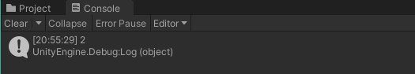
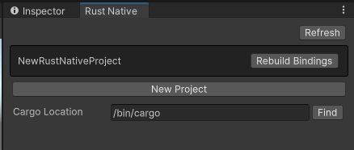

For the past 8 months, I have been completely addicted to the [`rust`](https://www.rust-lang.org) programming language. Its becoming a real issue. My wife will no longer speak to me and I've resorted to doing lines of pure oxidized metal straight off our kitchen table. But it wasn't always this way.

## How did my `rust` addiction start?

Well... it all started 8 months ago. I heard of this fancy new language that promised so much: compile time memory-safety, blazingly fast code, and cute little crabs 🦀. I, being a unity developer, found it difficult to get into the language. After all, how do I use it in the unity engine? And what the heck is this dark magic called the [b̵̡͑͑̍ŏ̷͉ŕ̷̹̲̩̽r̶̻̼͂͋͒o̶͙̬̽ẃ̶͉͙͠ ̶͇͎͖͠c̵̛͉̦̆̄h̴̤͚͋̿e̴̤̊̂̌ͅc̵̣̈k̸̻̣̻̓e̵̡͔͌̿r̶̘̿̒̔?](https://doc.rust-lang.org/1.8.0/book/references-and-borrowing.html)

I was nervous. But my curiosity was certainly peaked as I love the draw of squeezing more performance out of my code. This was exactly the kind or pressure I needed to cave. So the next step was my trek into the world of [Native Plugins](https://docs.unity3d.com/Manual/NativePlugins.html).

## What are Native Plugins?

Native Plugins are Unity's way of using libraries of native code you can write in languages such as C, C++, and Objective-C. At least according to [their website](https://docs.unity3d.com/Manual/NativePlugins.html). But what they really mean, is you can run any native library as long as it has a **C-style** interface. And come to find out, `rust` has just the tools to be able to so.

## My first dab of `rust`

Young and naive, I installed the tools to get a rust project up and running. I made a rust project using [`cargo`](https://doc.rust-lang.org/cargo/) put together this little snippet and built my first rust function! ([see here for what the whole project structure looks like](https://github.com/rhedgeco/UnityRustNative/tree/main/RustNative/NewRustNativeProject))

```rust
#[no_mangle]
/// Returns the integer `x` incremented by 1
pub extern "C" fn add_one(x: u32) -> u32 {
    x + 1
}
```

To get the ball rolling, I created a function called `add_one` that takes in an unsigned 32 bit integer (`u32`) and adds one to it. A simple function to be sure, but I'm only a rust fledgling here. The `extern "C"` part of the signature specifies to export this function with a **C-style** interface that can be called from outside our library. Lastly, I added a `#[no_mangle]` attribute above the function to tell the compiler essentially hey don't mess up my boy up too much so that he still can be identified by other programs alright?

All that was left was to shove my beautiful little library into the Unity Engine.

## Ham-fisting a `rust` library into the Unity Engine

Now just because Unity will let you shove a precompiled library into its innards, doesn't mean its going to like it. First I had to copy the `libNewRustNativeProject.so` file (`*.dll` if you are on Windows) into my unity assets folder. But Unity can't talk to it yet.

We will need to create a translator of sorts. I created a new `C#` file called `NewRustNativeProject.cs` and put the following:

```csharp
public static partial class NewRustNativeProject
{
    public const string NativeLib = "NewRustNativeProject";

    [DllImport(NativeLib, CallingConvention = CallingConvention.Cdecl, EntryPoint = "add_one")]
    public static extern uint add_one(uint x);
}
```

The `DllImport` attribute tells unity how to talk to the rust library. First its given the name for the library, which is `NewRustNativeProject` and told the entry point which was `add_one`. The method is named the same here, but it can be named whatever you want.

I was now able to call the library from anwhere in the Unity project. I created a little script, added `Debug.Log(NewRustNativeProject.add_one(1));` somewhere inside, and voila!



That was it. That was the dopamine hit I needed. After that, my world would never be the same.

## A spiral into **MADNESS**

Now that I was hooked I dove into the [Rust Book](https://doc.rust-lang.org/book/), watched tutorial after tutorial, read blog after blog. And here I am 8 months later. I've made a number of rust libraries. I've been cheating on unity by building my [own engine](https://github.com/rhedgeco/boba) from scratch in `rust`. And I've also been cheating on my wife... by building my own engine from scratch in `rust`. Every second of every day... is `RUST`.

Now that I'm completely entrenched in that sticky rust mucus, I have returned to shine a path for those that come after. The world of `rust` is glorious, and Unity plugins are a **GREAT** gateway drug into the insanity.

## Injecting **`RUST`** straight into my Bloodstream

Coming back to Unity after some time I wanted it to be easier to OD on `rust`. I have [built a tool](https://github.com/rhedgeco/UnityRustNative/releases/latest) for more easily creating plugins for the engine that covers the main pain points I ran into in the beginning.

First off, for any libraries larger than a single function, creating all those translation layers takes quite some time. But thats not the worst of it. 

One of the first issues that I ran into when making native plugins was that once loaded, they *COULD NOT* be unloaded. This meant that I had to restart the unity editor every time I made a change to the rust code which for anyone that ever used Unity... knows thats a pain in the ass.

The package I created to ease these pains can be [downloaded here](https://github.com/rhedgeco/UnityRustNative/releases/latest). Once installed in your project, in the top menu click **Window > Rust Native Manager**. This will open a custom window for creating and managing rust libraries.



Make sure to set the `cargo` location, and then  create a new project and pick a name. I already had one created there, but a fresh install should show no projects in that dark top area.

After creating a new project, in the unity project folder but outside the `Assets` folder should be a new folder named `RustNative`. Inside there will be the fresh `rust` project you created, all rip roaring and ready to go with the example code set up that I showed above.

I use the library [`interoptopus`](https://github.com/ralfbiedert/interoptopus) to generate the `C#` bindings in the `bind.rs` file within `src`. And the `bindings.rs` file in the `tests` directory to handle the binding generation. Take a look at the [`interoptopus docs`](https://docs.rs/interoptopus/latest/interoptopus/) for more on how to use the binding generator.

Lastly, whenever you change the rust code, click the `Reload Bindings` button next to your project and Unity will generate a new library with a unique ID and load it. This should allow you to make changes to your rust library without having to constantly close and reopen the editor.

## Closing Remarks

Hopefully this has served as a good beginning guide on how to most effectivelty develop a crippling `rust` addiction. While I can't speak for those in my life that care about me, I am in pure bliss using this language and I know you will be too. Stay safe and have fun! I'll catch you next time 👋
